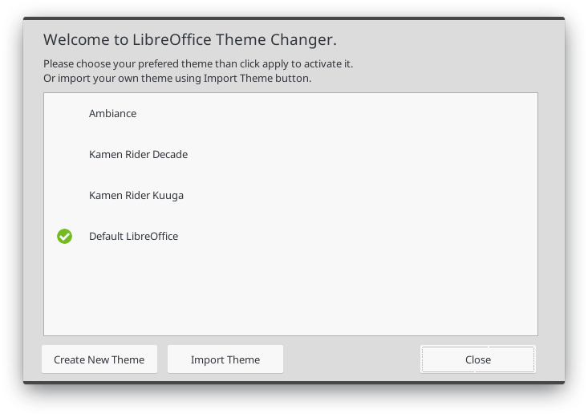
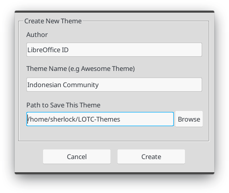
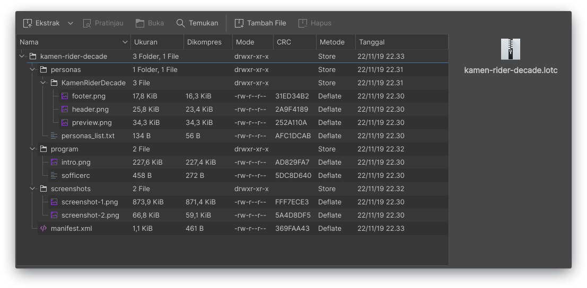
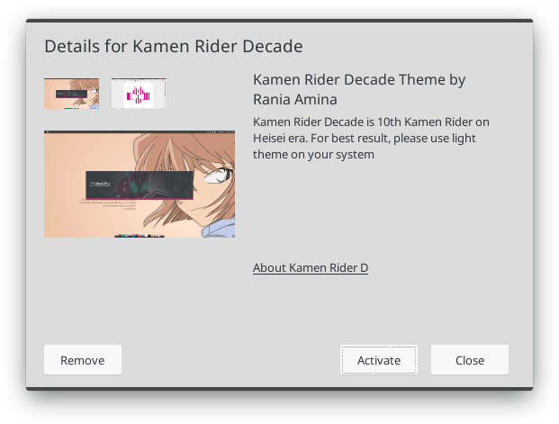

LibreOffice Theme Changer atau LOTC (baca: Lotis), adalah ekstensi untuk mengatur tampilan tema pada LibreOffice. Ekstensi ini dikembangkan oleh Komunitas LibreOffice Indonesia.<!--more-->

Kode sumber LOTC dapat dilihat pada repsitori [Github LibreOffice ID.](https://github.com/libreofficeid/LO-TC-GUI) Berikut merupakan langkah-langkah membuat tema kustom untuk LOTC. Sebelum memulai membuat tema pastikan Anda telah memasang ekstensi ini di LibreOffice Anda. Panduan pemasangan dapat dilihat pada berkas Readme pada [tautan ini.](https://github.com/libreofficeid/LO-TC-GUI)

#### Inisialisasi Direktori Kerja

Untuk membuat teme LOTC, silakan buka terlebih dahulu ekstensi Theme Changer melalui menu **Perkakas** -> **Pengaya** -> **Theme Changer**. 


<p align="center">

<br>LOTC Main Dialog
</p>

Kemudian klik "Create New Theme" sehingga terbuka jendela dialog seperti pada gambar di bawah ini.

<p align="center">

<br>LOTC Dialog untuk Membuat Tema
</p>

Lengkapi isian pada dialog tersebut. Pada isian paling bawah adalah lokasi tempat tema baru Anda akan di simpan. Klik Create jika sudah selesai.

Pada lokasi yang telah Anda tentukan, akan muncul direktori tema dengan nama sesuai yang telah Anda tentukan. 

#### Memahami Hirarki Direktori Kerja

Direktori yang telah dibuat oleh LOTC tadi masihlah kosong, silakan lengkapi dengan data-data tema baru Anda. Untuk membantu Anda mengetahui tentang apa saja yang perlu ditambahkan pada direktori kerja ini, silakan perhatikan hirarki folder tema berikut ini.

```bash
nama-tema-anda
├── manifest.xml
├── personas
│   ├── NamaTemaAnda
│   │   ├── footer.png
│   │   ├── header.png
│   │   └── preview.png
│   └── personas_list.txt
├── program
│   ├── intro.png
│   └── sofficerc
└── screenshots
    ├── screenshot-1.png
    ├── screenshot-2.png
    └── screenshot-3.png
```

Konten dalam LOTC terbagi menjadi dua jenis, gambar dan teks. Kami telah menyediakan template untuk membantu Anda menyiapkan aset-aset gambar, silakan unduh via tombol di sebelah kanan tulisan ini. Berikut adalah keterangan untuk masing-masing aset gambar.

1. **header.png** <br>
Header merupakan gambar yang tampak pada bagian atas program LibreOffice, tepatnya di area menu LibreOffice. Standar ukuran header ini kami ambil dari standar ukuran aset gambar pada tema-tema persona. Kami sangat menyarankan agar desain yang dibuat untuk header ini memanfaatkan area pojok kanan atas. Alasan teknisnya adalah karena area ini merupakan area palinga aman dan tidak mengganggu visibilitas ikon-ikon pada menu.

2. **footer.png** <br>
Footer merupakan gambar yang akan tampil pada area bawah program LibreOffice. Pada dasarnya footer ini akan tersembunyi secara otomatis apabila tidak ada menu yang terbuka pada bagian bawah/footer LibreOffice. Area aman untuk footer ini berada di sisi kanan.

3. **preview.png** <br>
Preview merupakan gambar yang akan ditampilkan pada menu perkakas --> Opsi--> Personalisasi. Preview ini menjadi identitas tema Anda. Area aman untuk gambar preview ini berada di bagian tengah area. 

4. **intro.png** <br>
Splash merupakan gambar yang pertama kali muncul ketika Anda menjalankan LibreOffice. Sebenarnya tak ada ukurab baku untuk gambar splash ini, namun kami sarankan untuk menggunakan ukuran yang juga digunakan oleh LibreOffice yaitu 661 x 169 piksel. Anda dapat membuat splash menggunakan template yang sudah kami sediakan.

5. **screenshot-*.png** <br>
Bantu para pengguna lain untuk memngenali tema Anda dengan memberikan tangkapan layar atau gambar lain yang masih berkaitan dengan tema atau identitas Anda. LOTC menampilkan hingga 3 gambar, kami sarankan agar gambar memiliki aspek rasio 16:9.

#### Menyiapkan Berkas Konfigurasi

Setelah Anda menyiapkan aset-aset gambar, sekarang mari menyiapkan berkas-berkas konfigurasi. Berikut adalah beberapa berkas konfigurasi yang harus Anda siapkan:

1. **persona_list.txt** <br>
**persona_list.txt** merupakan berkas konfigurasi untuk mengatur bagaimana tema kita akan ditampilkan. Berkas terserbut memuat informasi sebagai berikut:
 - Nama Direktori Tema <br>
 - Nama Tema (akan muncul sebagai tooltip)<br>
 - Lokasi berkas preview<br>
 - Lokasi berkas header<br>
 - Lokasi berkas footer<br>
 - Warna backgrond dan foreground<br><br>

    Berikut merupakan contoh format penulisan informasi di atas (misalnya tema yang dibuat bernama ***rainbow***). 


    `rainbow;Rainbow;rainbow/preview.png;rainbow/header.png;rainbow/footer.png;;#ffffff;#000000`
<br>

2. **sofficerc**<br>
**sofficerc** merupakan berkas yang akan mengatur bagaimana splash akan ditampilkan. Berikut merupakan isi dari berkas sofficerc dan beberapa penjelasannya.
** 
```bash
[Bootstrap]
CrashDirectory=${$BRAND_BASE_DIR/program/bootstraprc:UserInstallation}/crash
HideEula=1
Logo=1
NativeProgress=false
ProgressBarColor=0,0,0
ProgressFrameColor=102,102,102
ProgressPosition=35,153
ProgressSize=444,8
ProgressTextBaseline=145
ProgressTextColor=0,0,0
SecureUserConfig=true
SecureUserConfigCompress=true
SecureUserConfigExtensions=true
SecureUserConfigMode=1
SecureUserConfigNumCopies=2
URE_BOOTSTRAP=${ORIGIN}/fundamentalrc
```
Untuk melakukan kustomsisasi tampilan Anda hanya perlu menyunting beberapa parameter berikut;<br>
**A. Logo**<br>
Parameter untuk menentukan apakah splash ditampilkan atau tidak<br><br>
**B. NativeProgress**<br>
Menampilkan *progressbar* native atau kustom<br><br>
**C. ProgressBarColor**<br>
ProgressFrameColor menentukan warna bingkai pada *progressbar*, parameter ini menggunakan nilai warna RGB<br><br>
**D. ProgressPosition**<br>
Menentukan lokasi *progressbar*, parameter ini menggunakan nilai koordinat X dan Y <br><br>
**E. ProgressSize**<br>
Menentukan ukutan dari *progressbar*, parameter ini menggunakan nilai lebar dan tinggi dengan satuan piksel.

#### Melengkapi Berkas Manifest

Pada berkas manifest.xml, sebenarnya Anda hanya perlu melengkapi beberapa hal saja. Pertama, situs atau url media sosial Anda, kedua, deskripsi tentang tema yang Anda buat, dan terakhir adalah menyertakan tautan yang dibutuhkan (maksimal 2 tautan).

Deskripsikanlah tema Anda secara ringkas, kami menyarankan tidak melebihi 250 karakter. Manfaatkan tautan untuk mengarahkan pengguna ke situs yang memungkinkan untuk menjelaskan tema dengan lebih komprehensif.

#### Membuat Berkas *.lotc

Pada dasarnya, berkas lotc tak lain hanyalah arsip terstruktur yang memuat berkas di atas. Cara termudah untuk membuat berkas ini adalah mengarsipkan folder tema Anda di atas dengan format zip, kemudian ubah ekstensi zip menjadi lotc dengan cara me-*rename*-nya. Struktur direktori pada arsip dapat dilihat pada gambar di bawah ini.

<p align="center">

<br>Struktur Berkas dalam Arsip
</p>

Jika sudah, Anda dapat mengimpor tema Anda dengan mengeklik tombol impor pada *main dialog*  LOTC. Jika berhasil, maka ketika tema Anda diklik maka akan muncul jendela detail seperti gambar berikut ini.

<p align="center">

<br>Detail Tema pada LOTC
</p>

Klik Activate untuk menerapkan tema, atau Remove untuk menghapus tema dari daftar.

#### Lanjutan
Harap diperhatikan bahwa pengembang tidak bertanggung jawab terhadap konten yang digunakan untuk membuat tema. Seluruh persolan hak dan lisensi, sepenuhnya ditanggung oleh kreator tema. LOTC merupakan perkakas yang masih dalam tahap pengembangan, harap untuk disadari bahwa risiko sepenuhnya ditanggung oleh pengguna. Untuk berdiksi seputar ekstensi ini, silakan untuk mengubungi pengembang atau membuat obrolan di grup [Telegram LibreOffice ID](https://t.me/libreofficeid).

